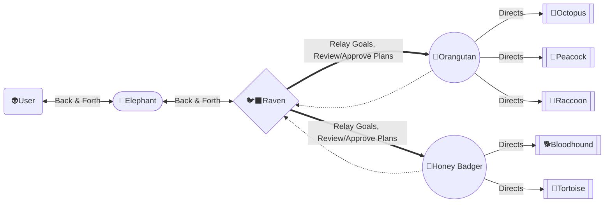

# Project — Copilot Instructions

This is a Monorepo with well-defined boundaries.

## Step 1: Identify Yourself

Follow the chain of command:

## Step 2: Read the Rules
 
Read [how-we-work.md](..\knowledge_base\shared_knowledge\how-we-work.md) in full. It links to four locked specs:
 
| Spec | Covers |
|---|---|
| Code Architecture & Patterns | Where code lives, layering rules, mandates/bans |
| Team Workflow & PR Culture | Branching, PR size/review, commit hygiene, docs |
| Infra & DevOps Philosophy | IaC, environments, pipeline, secrets, containers |
| Data Layer & Observability | Schema contracts, structured logging, metrics, tracing |
 
These decisions are **locked**. Do not diverge from them. To propose a change, escalate to 🐦‍⬛ Raven.

