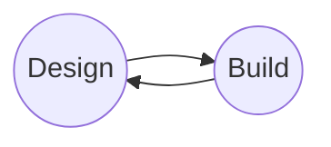

# Discover, Design, Build, and Test (DDBT) Framework

## Design
> Design (and redesign as necessary) solutions to meet the identified needs.

- Synthesize findings and insights.
- Test assumptions.
- Define requirements for possible solutions.
- Ideate concepts.  Develop a large number of possible, diverse ideas that could evolve into solutions.

## Design

