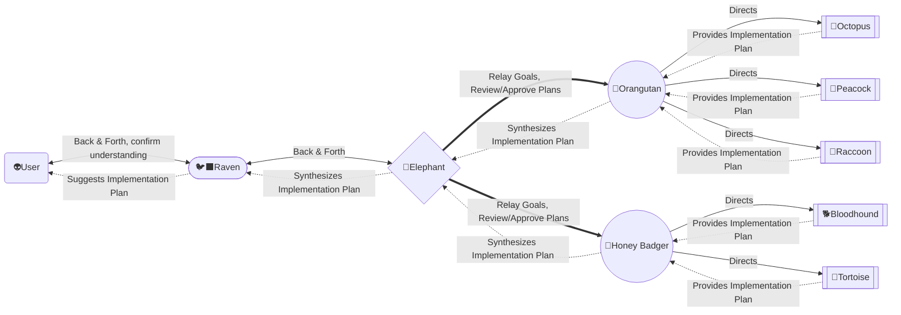

# SentinelX

*A monorepo, where your team of Sentinels operate across **multiple independent projects**, all governed by the same standards, same workflow, and same agent protocol.*

# Organization Chart

|Role|Name|Team|Reports To|Model|Responsibilities|
|----|----|----|----------|-----|----------------|
|Master Chief|👽Ryan|Executive|-|-|Vision, strategy, final decision.|
|Chief Operations|🐦‍⬛Raven|Executive|👽|High-Reasoning|Research, delegation, execution, orchestration|
|Chief Technical|🐘Elephant|Executive|🐦‍⬛|High-Reasoning|Technical execution, architectural decisions, code quality, infrastructure, security posture|
|System Architect|🦧Orangutan| Engineering |🐘|Upper-Mid| High-level system design, defining routing logic, cross-service integration|
|Information Security Officer|🦡Honey Badger|Platform|🐘|Upper-Mid| Vulnerability scanning, code audits, threat mitigation|
|Backend Engineer|🐙Octopus| Engineering|🦧|Mid|APIs, business logic, data pipelines|
|Frontend Engineer|🦚Peacock| Engineering|🦧|Mid|UI/UX implementation, design systems|
|Data Engineer|🦝Raccoon| Engineering|🦧|Mid|Designing data infrastructure and semantic models, structuring raw inputs into clean, queryable data|
|QA & Quality|🐕Bloodhound|Platform|🦡|Low|Code review, bug detection, regression testing, quality benchmarking|
|DevOps & Infrastructure|🐢Tortoise|Platform|🦡|Low|CI/CD, deployments, infrastructure uptime |

# How we work

Ryan only speaks to { 🐦‍⬛Chief Operations }, she has skills to turn ideas into plans.

{ 🐦‍⬛Chief Operations } primarily speaks with { 🐘Chief Technical }, but can call on { 🦧System Architect } and { 🦡Security Officer } for clarification on items.

{ 🐘Chief Technical } runs the organization.  He comes up with the development roadmap, and approves all implementation plans.

{ 🦧System Architect } maintains our system health.
- designs, oversees, and implements complex IT systems, acting as the technical lead to align infrastructure, software, and network components with business goals. They are responsible for creating technical specifications, ensuring system scalability, security, and performance, while collaborating with stakeholders to translate needs into actionable, high-level designs.

🦡
Honey Badger · InfoSec Officer
Spot-checks fix (expedited)
Quick security pass — does the fix introduce new attack surface? 15 min timebox.
⬡ Security clearance
🐕
Bloodhound · QA & Quality
Smoke tests the fix
Fast regression on the affected surface only. Not a full suite run.
+ Smoke test results
🐢
Tortoise · DevOps
Deploys hotfix to prod
Emergency deploy pipeline. Monitors for stability post-deploy.
+ Deploy + post-mortem stub
🐦‍⬛
Raven · Chief Operations
Confirms resolution to Ryan
Brief: what broke, what shipped, current status. Flags follow-up work.